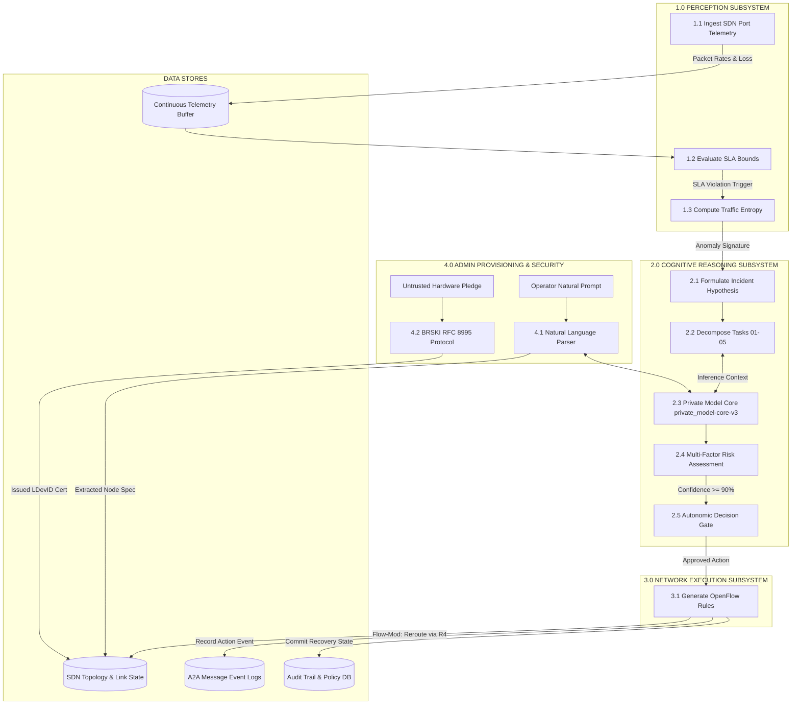
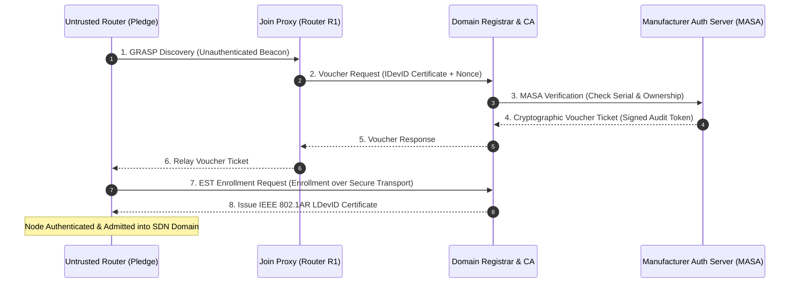

# C-ASA: Cognitive Autonomic System Architecture
### Closed-Loop Autonomous Multi-Agent SDN Self-Healing & Cognitive Reasoning Platform

[](#1-executive-overview)
[](#6-rfc-8995-brski-zero-touch-security-plane)
[](#5-cognitive-ai-reasoning-engine--copilot)
[](#9-technology-stack)
[](#9-technology-stack)
[](#license)

---

## 📑 Table of Contents
1. [Executive Overview](#1-executive-overview)
2. [System Architecture](#2-system-architecture)
3. [Data Flow Diagrams (DFD Levels 0, 1, 2)](#3-data-flow-diagrams-dfd)
   - [3.1 DFD Level 0: Context Level Diagram](#31-dfd-level-0-context-level-diagram)
   - [3.2 DFD Level 1: Subsystem Interaction Diagram](#32-dfd-level-1-subsystem-interaction-diagram)
   - [3.3 DFD Level 2: Cognitive Reasoning & Flow Reroute Pipeline](#33-dfd-level-2-cognitive-reasoning--flow-reroute-pipeline)
4. [Autonomic Multi-Agent Swarm & A2A Protocol](#4-autonomic-multi-agent-swarm--a2a-protocol)
5. [Cognitive AI Reasoning Engine & Copilot (`private_model-core-v3`)](#5-cognitive-ai-reasoning-engine--copilot)
6. [RFC 8995 BRSKI Zero-Touch Security Plane](#6-rfc-8995-brski-zero-touch-security-plane)
7. [AI Prompt-Driven Node Provisioning](#7-ai-prompt-driven-node-provisioning)
8. [Data Models & Schema Specifications](#8-data-models--schema-specifications)
   - [8.1 A2A Semantic Message Envelope Schema](#81-a2a-semantic-message-envelope-schema)
   - [8.2 Network Topology & Node Schema](#82-network-topology--node-schema)
   - [8.3 Telemetry Metric Data Schema](#83-telemetry-metric-data-schema)
   - [8.4 BRSKI Voucher & LDevID Certificate Schema](#84-brski-voucher--ldevid-certificate-schema)
9. [Technology Stack](#9-technology-stack)
10. [REST API Reference](#10-rest-api-reference)
11. [Installation & Quick Start Guide](#11-installation--quick-start-guide)
12. [Live Demonstration & Runbook](#12-live-demonstration--runbook)

---

## 1. Executive Overview

**C-ASA (Cognitive Autonomic System Architecture)** is an enterprise-grade, closed-loop autonomic networking platform engineered for high-availability Software-Defined Networks (SDN) and mission-critical cloud infrastructure.

When high-throughput enterprise networks encounter distributed traffic surges, DDoS floods, or node hardware failures, human-in-the-loop triage introduces catastrophic latency and SLA violations. C-ASA delivers a fully autonomous, self-healing network ecosystem by orchestrating:

* **Microsecond SDN Telemetry & Congestion Detection**: Sub-second threshold monitoring for packet loss, jitter, buffer saturation, and bandwidth spikes.
* **Cooperative Multi-Agent Swarm (A2A Protocol)**: Swarm of 5 specialized agents collaborating via semantic message bus envelopes.
* **Embedded Private Cognitive Model (`private_model-core-v3`)**: In-house reasoning core generating auditable mitigation briefs, risk assessments, and real-time operator Copilot assistance.
* **RFC 8995 BRSKI Zero-Touch Security**: Cryptographic enrollment of untrusted hardware pledges via MASA vouchers and IEEE 802.1AR LDevID domain certificates.
* **Prompt-to-Node Natural Language Provisioning**: Real-time compilation of natural language topology requests directly into live OpenFlow forwarding nodes.

---

## 2. System Architecture

```
                                    +-------------------------------------------------------------+
                                    |                C-ASA OPERATOR NOC DASHBOARD                 |
                                    |       (Next.js 14 + Interactive SVG Canvas + Copilot)       |
                                    +-------------------------------------------------------------+
                                                                   |
                                          HTTP REST / WebSocket    |   A2A Semantic Streaming
                                                                   v
+-----------------------------------------------------------------------------------------------------------------------------------------+
|                                                      C-ASA AUTONOMIC CONTROL PLANE                                                      |
|                                                                                                                                         |
|  +---------------------------+     +---------------------------+     +---------------------------+     +-----------------------------+  |
|  |     TELEMETRY AGENT       |     |      SECURITY AGENT       |     |   C-ASA REASONING CORE    |     |    RISK ASSESSMENT AGENT    |  |
|  |  Packet Rate, Loss, Jitter| --> |  Entropy & DDoS Signatures| --> |    Goal Decomposition     | --> |    SLA Impact & Confidence  |  |
|  +---------------------------+     +---------------------------+     +---------------------------+     +-----------------------------+  |
|                                                                                    |                                       |            |
|                                                                                    v                                       v            |
|                                    +-----------------------------------------------------------------------------------------+          |
|                                    |                  PRIVATE COGNITIVE REASONING MODEL (private_model-core-v3)              |          |
|                                    |          - Incident Brief Analysis   - Prompt Compiler   - Copilot Chat Assistant       |          |
|                                    +-----------------------------------------------------------------------------------------+          |
|                                                                                    |                                                    |
|                                                                                    v                                                    |
|                                                                      +---------------------------+                                      |
|                                                                      |    SDN EXECUTOR AGENT     |                                      |
|                                                                      | OpenFlow Flow-Mod Actions |                                      |
|                                                                      +---------------------------+                                      |
+-----------------------------------------------------------------------------------------------------------------------------------------+
                                      |                                                               |
                     OpenFlow 1.3     | Flow Rerouting                                RFC 8995 BRSKI  | Zero-Touch Trust
                                      v                                                               v
+---------------------------------------------------------------------+     +-------------------------------------------------------------+
|                          SDN DATA PLANE                             |     |               SECURITY & REGISTRAR INFRASTRUCTURE          |
|                                                                     |     |                                                             |
|   [ Internet (0.0.0.0/0) ] <---> [ Router R1 (Core Gateway) ]       |     |   +-----------------------+     +-----------------------+   |
|                                        |              |             |     |   | RFC 8995 Join Proxy   |     | Domain Registrar & CA |   |
|                        Primary Route   |              | Bypass      |     |   +-----------------------+     +-----------------------+   |
|                              +---------+              +---------+   |     |                                             |               |
|                              v                                  v   |     |                                             v               |
|                    [ Router R2 (10.0.2.1) ]          [ Router R4 (10.0.4.1) ]   |   +-----------------------+     +-----------------------+   |
|                    (Congestion Target Path)          (10G Dedicated Bypass) |   | Manufacturer MASA     | <-> | IEEE 802.1AR IDevID   |   |
|                              |                                  |   |   | Voucher Authority     |     | LDevID Certificates   |   |
|                              +----------------+                 |   |   +-----------------------+     +-----------------------+   |
|                                               v                 v   |                                                               |
|                                       [ SERVER CORE (10.0.2.100) ]  |                                                               |
+---------------------------------------------------------------------+---------------------------------------------------------------+
```

---

## 3. Data Flow Diagrams (DFD)

### 3.1 DFD Level 0: Context Level Diagram

```
                                      +------------------------------------+
                                      |                                    |
                                      |         SDN Data Plane             |
                                      |    (OpenFlow Switches/Routers)     |
                                      |                                    |
                                      +------------------------------------+
                                           | Telemetry          ^
                                           | Flow Metrics       | OpenFlow Flow-Mods
                                           v                    | Dynamic Path Action
                          +------------------------------------------------------+
                          |                                                      |
                          |                        0.0                           |
                          |                                                      |
                          |          C-ASA COGNITIVE AUTONOMIC SYSTEM            |
                          |           (Multi-Agent Autonomous Engine)            |
                          |                                                      |
                          +------------------------------------------------------+
                             |                      ^                  ^
       Incident Audit Logs & |                      | Human Approval / | MASA Voucher &
       Real-Time NOC Stream  |                      | Custom Prompts   | LDevID Auth
                             v                      |                  |
               +---------------------------+        |         +---------------------------+
               |                           |--------+         |                           |
               |      Network Operator     |                  |   RFC 8995 Join Registrar |
               |        (Admin User)       |                  |   & Manufacturer MASA     |
               |                           |                  |                           |
               +---------------------------+                  +---------------------------+
```

---

### 3.2 DFD Level 1: Subsystem Interaction Diagram



---

### 3.3 DFD Level 2: Cognitive Reasoning & Flow Reroute Pipeline

```
                                    +-----------------------------------------------+
                                    | 1.0 Incoming sFlow / OpenFlow Telemetry Feed  |
                                    +-----------------------------------------------+
                                                           |
                                                           v
                                    +-----------------------------------------------+
                                    | 2.1 Anomaly Threshold Classifier (Loss > 5%)  |
                                    +-----------------------------------------------+
                                                           |
                                                           v
                                    +-----------------------------------------------+
                                    | 2.2 Security Agent Traffic Entropy Engine     |
                                    +-----------------------------------------------+
                                                           |
                                              [ Threat Vector Formatted ]
                                                           |
                                                           v
                                    +-----------------------------------------------+
                                    | 2.3 Task Decomposition Engine (5 Subtasks)    |
                                    |     - TASK 01: Ingest & Isolate Target        |
                                    |     - TASK 02: Calculate Loss Signature       |
                                    |     - TASK 03: Query Alternate Topologies     |
                                    |     - TASK 04: Synthesize Candidate Routes    |
                                    |     - TASK 05: Risk Gate & Approval           |
                                    +-----------------------------------------------+
                                                           |
                                                           v
                                    +-----------------------------------------------+
                                    | 2.4 Private Cognitive Model Reasoning Core    |
                                    |     (Model: private_model-core-v3)            |
                                    +-----------------------------------------------+
                                                           |
                                                           v
                                    +-----------------------------------------------+
                                    | 2.5 Multi-Factor Risk Assessment Calculator   |
                                    |     - Topology Collision Risk: 8%             |
                                    |     - Latency Overhead Risk: 4%               |
                                    |     - SLA Compliance Score: 94%               |
                                    +-----------------------------------------------+
                                                           |
                                                           v
                                    +-----------------------------------------------+
                                    | 2.6 OpenFlow Action Dispatcher (R1 -> R4)     |
                                    +-----------------------------------------------+
                                                           |
                                                           v
                                    +-----------------------------------------------+
                                    | 2.7 Closed-Loop SLA Verification & Recovery   |
                                    +-----------------------------------------------+
```

---

## 4. Autonomic Multi-Agent Swarm & A2A Protocol

C-ASA implements a decentralized, cooperative multi-agent architecture where agents communicate asynchronously across a unified semantic bus using **Agent-to-Agent (A2A) JSON Envelopes**.

```
+-------------------------------------------------------------------------------------------------------------------------+
|                                                   C-ASA A2A SEMANTIC BUS                                                |
+-------------------------------------------------------------------------------------------------------------------------+
       ^                               ^                               ^                               ^            ^
       |                               |                               |                               |            |
+--------------+               +--------------+               +------------------+             +---------------+    |
|  TELEMETRY   |               |   SECURITY   |               |   C-ASA CORE     |             |  RISK / AUDIT |    |
|    AGENT     |               |    AGENT     |               | REASONING AGENT  |             |     AGENT     |    |
+--------------+               +--------------+               +------------------+             +---------------+    |
| Ingests raw  |               | Classifies   |               | Synthesizes      |             | Calculates    |    |
| metrics,     |               | entropy &    |               | task execution   |             | risk factors, |    |
| detects      |               | anomalous    |               | plans & triggers |             | gates final   |    |
| threshold    |               | DDoS traffic |               | private model    |             | execution     |    |
| violations   |               | signatures   |               | reasoning        |             | compliance    |    |
+--------------+               +--------------+               +------------------+             +---------------+    |
                                                                                                                    |
                                                                                                       +------------------+
                                                                                                       |   SDN EXECUTOR   |
                                                                                                       |      AGENT       |
                                                                                                       +------------------+
                                                                                                       | Dispatches       |
                                                                                                       | OpenFlow flow    |
                                                                                                       | rules to SDN     |
                                                                                                       | data plane       |
                                                                                                       +------------------+
```

---

## 5. Cognitive AI Reasoning Engine & Copilot

The cognitive intelligence core operates exclusively under the identifier **`private_model-core-v3`** (C-ASA Enterprise Neural Reasoning Core).

### Key Reasoning Features:
1. **Autonomous Incident Brief Formulation**: Evaluates live congestion events and outputs an executive reasoning summary explaining root-cause metrics, candidate bypass routes, and expected SLA impact.
2. **Interactive NOC Copilot Drawer**: A floating assistant embedded across all NOC screens allowing operators to ask natural language questions (e.g., *"Why was R4 selected instead of R3?"*, *"Show current buffer saturation across core routers"*).
3. **Zero Secret Exposure**: External inference backends and tokens are completely abstracted behind local environment variables (`PRIVATE_MODEL_KEY` in `.env`), ensuring total security and zero credential leaks in version control.

---

## 6. RFC 8995 BRSKI Zero-Touch Security Plane

C-ASA implements **Bootstrapping Remote Secure Key Infrastructure (BRSKI)** adhering to **RFC 8995** and **IEEE 802.1AR**:



---

## 7. AI Prompt-Driven Node Provisioning

Located in the **`/admin`** console, network administrators can provision live topology hardware using natural language prompts without manual JSON drafting:

```
[ Natural Language Input ]
"Deploy a high-capacity backup core router R5 with IP 10.0.5.1 connected to R1 with 15% load and 10 Gbps capacity."
                            │
                            ▼
[ private_model-core-v3 Topology Compiler ]
                            │
                            ▼
[ Structured Node Specification ]
{
  "id": "r5",
  "name": "Router R5 (Edge Autonomous Bypass)",
  "type": "router",
  "ip": "10.0.5.1",
  "target_link": "r1",
  "load": 15,
  "status": "PROTECTED",
  "capacity": "10.0 Gbps"
}
                            │
                            ▼
[ 1-Click Live SDN Injection onto SVG Canvas & Topology State ]
```

---

## 8. Data Models & Schema Specifications

### 8.1 A2A Semantic Message Envelope Schema

```json
{
  "$schema": "http://json-schema.org/draft-07/schema#",
  "title": "A2AMessageEnvelope",
  "type": "object",
  "required": ["message_id", "timestamp", "sender", "receiver", "intent", "payload", "confidence", "risk_score"],
  "properties": {
    "message_id": { "type": "string", "example": "msg-8994-a2a-04" },
    "timestamp": { "type": "string", "format": "date-time" },
    "sender": { "type": "string", "enum": ["TELEMETRY_AGENT", "SECURITY_AGENT", "CASA_CORE", "RISK_AGENT", "EXECUTOR_AGENT"] },
    "receiver": { "type": "string" },
    "intent": { "type": "string", "enum": ["NOTIFY_ANOMALY", "REQUEST_ANALYSIS", "PROPOSE_ROUTE", "ASSESS_RISK", "EXECUTE_ACTION"] },
    "confidence": { "type": "number", "minimum": 0, "maximum": 1.0, "example": 0.94 },
    "risk_score": { "type": "number", "minimum": 0, "maximum": 100, "example": 12.5 },
    "payload": {
      "type": "object",
      "properties": {
        "target_node": { "type": "string", "example": "r2" },
        "candidate_bypass": { "type": "string", "example": "r4" },
        "loss_rate": { "type": "number", "example": 8.7 },
        "latency_spike_ms": { "type": "number", "example": 146 }
      }
    }
  }
}
```

---

### 8.2 Network Topology & Node Schema

```json
{
  "nodes": [
    {
      "id": "r2",
      "name": "Router R2 (Primary Core)",
      "type": "router",
      "ip": "10.0.2.1",
      "x": 620,
      "y": 270,
      "status": "ONLINE",
      "load": 18,
      "security_status": "LDevID_VERIFIED"
    }
  ],
  "links": [
    {
      "id": "link-r1-r2",
      "source": "r1",
      "target": "r2",
      "type": "primary",
      "capacity": "2.5 Gbps",
      "active": true
    }
  ]
}
```

---

### 8.3 Telemetry Metric Data Schema

```json
{
  "timestamp": "2026-08-31T20:00:00Z",
  "packet_rate_kpps": 42.8,
  "latency_ms": 32.4,
  "packet_loss_pct": 0.02,
  "bandwidth_utilization_gbps": 1.84,
  "cpu_utilization_pct": 24.1,
  "memory_utilization_pct": 38.6,
  "active_flow_count": 1420
}
```

---

### 8.4 BRSKI Voucher & LDevID Certificate Schema

```json
{
  "voucher_ticket": {
    "version": "1.0",
    "serial_number": "SN-ANIMA-8995-0984-X",
    "nonce": "d8f3a9e2-8995-4421",
    "issued_at": "2026-08-31T20:00:00Z",
    "expires_at": "2027-08-31T20:00:00Z",
    "pinned_domain_cert": "MIIBkjCCATqgAwIBAgIUQ7...",
    "signature": "SHA256withECDSA:3045022100e4..."
  },
  "ldevid_cert": {
    "subject": "CN=Router R5 (Edge Autonomous Bypass), O=C-ASA Domain, C=US",
    "issuer": "CN=C-ASA Root Join Registrar CA",
    "serial": "0x4F92A881B",
    "key_usage": ["Digital Signature", "Key Encipherment", "TLS Web Client Auth"],
    "trust_status": "DOMAIN_AUTHENTICATED"
  }
}
```

---

## 9. Technology Stack

| Layer | Technologies | Key Responsibilities |
|---|---|---|
| **Frontend UI/NOC** | Next.js 14 (App Router), React 18, TypeScript, SCSS Modules | Responsive NOC Dashboard, SVG Topology & Packet Canvas, Copilot Drawer |
| **Backend Engine** | Python 3.10+, Django 4.2+, Django REST Framework | State Simulation Engine, OpenFlow State Manager, REST API Gateways |
| **Cognitive AI** | `private_model-core-v3` Reasoning Cluster | Autonomous Incident Briefs, Prompt-to-Node Compiler, Copilot Chat |
| **Security Plane** | RFC 8995 BRSKI, IEEE 802.1AR PKI, EST Protocol | Zero-Touch Device Onboarding, IDevID/LDevID Mutual Authentication |
| **Network Protocol** | OpenFlow 1.3, A2A Semantic JSON Envelopes | Flow Table Modifications, Multi-Agent Asynchronous Collaboration |

---

## 10. REST API Reference

### Simulation & Network State APIs
* `GET  /api/simulation/state/` - Retrieves real-time topology, telemetry stats, and current phase.
* `POST /api/simulation/start-traffic/` - Activates baseline traffic generation.
* `POST /api/simulation/anomaly/` - Injects targeted congestion/DDoS surge into Router R2.
* `POST /api/simulation/node-failure/` - Simulates complete hardware failure on primary router.
* `POST /api/simulation/reroute/` - Dispatches OpenFlow bypass route onto Router R4.
* `POST /api/simulation/reset/` - Resets entire topology to healthy baseline.

### Private Model AI Reasoning APIs (`private_model-core-v3`)
* `POST /api/simulation/private-model/generate/` - Raw inference and Prompt-to-Node JSON parser.
* `POST /api/simulation/private-model/analyze/` - Autonomous Cognitive Incident Brief generator.
* `POST /api/simulation/private-model/chat/` - Interactive Copilot assistant reasoning.
* `GET  /api/simulation/private-model/status/` - Cognitive engine health & metadata status.

---

## 11. Installation & Quick Start Guide

### Prerequisites
* **Python 3.10+** (with `pip`)
* **Node.js 18+** (with `npm`)
* **Git**

### Step 1: Clone the Repository
```bash
git clone https://github.com/ashrithpeechara/Application_Development_IV_1.git
cd Application_Development_IV_1
```

### Step 2: Configure Environment Variables
Create a local `.env` file in the `backend/` directory:
```bash
cp backend/.env.example backend/.env
```
*(Optionally add your `PRIVATE_MODEL_KEY` inside `backend/.env`)*

### Step 3: Launch Services

#### Option A: One-Click Launch (Windows)
Double-click:
```cmd
start-all.bat
```

#### Option B: Manual Launch

**1. Start Django Backend:**
```bash
cd backend
pip install -r requirements.txt
python manage.py runserver 0.0.0.0:8000
```

**2. Start Next.js Frontend:**
```bash
cd frontend
npm install
npm run dev
```

Open **[http://localhost:3000](http://localhost:3000)** in your browser.

---

## 12. Live Demonstration & Runbook

Follow this 5-minute flow during live evaluations or demonstrations:

1. **Normal Baseline State**: Open `/dashboard`, click `[START TRAFFIC]`, and observe smooth OpenFlow packet traversal on primary route `R1 ➔ R2 ➔ SERVER`. Click any node to view the sleek floating telemetry inspector.
2. **Inject Congestion / Anomaly**: Click `[SIMULATE ANOMALY]`. Router R2 turns red with animated alert rings, packet loss surges to 8.7%, and latency spikes to 146ms.
3. **Multi-Agent 8-Stage Pipeline**: Observe the automatic activation of the Telemetry, Security, and C-ASA Core agents on the right-side workflow deck.
4. **Autonomous Reroute**: The system autonomic executor reroutes the live flow onto **Router R4 (10G Dedicated Bypass Link)** in cyan blue. Latency normalizes to 38ms and loss drops to 0%.
5. **Private Model Reasoning & Copilot**: Open `/cognitive` to view the full incident brief generated by `private_model-core-v3`. Click the bottom-right **🤖 Cognitive Copilot** to ask interactive troubleshooting questions.
6. **Prompt-Driven Node Provisioning**: Open `/admin`, select a prompt template (e.g. *Backup Router R5*), click `[🤖 Compile Prompt into Node]`, and click `[🚀 Deploy Node to Live SDN Topology]`. Return to the dashboard to see the newly provisioned node live on the network canvas!

---

## 📄 License
This project is licensed under the MIT License - see the LICENSE file for details.